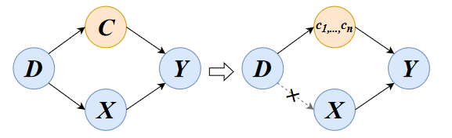
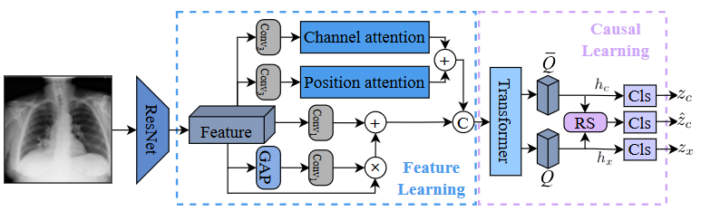

# Introdunction
This is the official implementation of the paper ["Chest X-ray Image Classification: A Causal Perspective"].
## Abstract

The chest X-ray (CXR) is one of the most common and easy-to-get medical tests used to diagnose common diseases of the chest. Recently, many deep learning-based methods have been proposed that are capable of effectively classifying CXRs. Even though these techniques have worked quite well, it is difficult to establish whether what these algorithms actually learn is the cause-and-effect link between diseases and their causes or just how to map labels to photos.
In this paper, we propose a causal approach to address the CXR classification problem, which constructs a structural causal model (SCM) and uses the backdoor adjustment to select effective visual information for CXR classification. Specially, we design different probability optimization functions to eliminate the influence of confounders on the learning of real causality. Experimental results demonstrate that our proposed method outperforms the open-source NIH ChestX-ray14 in terms of classification performance.



## Framework:



# Quick start

1. Clone this repo:
```sh
git clone 
cd CausalCXR
```

2. Install [```cuda```](https://developer.nvidia.com/cuda-downloads), [```PyTorch``` and ```torchvision```](https://pytorch.org/).

Please make sure they are compatible.
```sh
cuda==11, torch==1.9.0, torchvision==0.10.0, python==3.7.3
```

3. Data preparation.

Download [Chest X-ray14](https://nihcc.app.box.com/v/ChestXray-NIHCC/folder/36938765345).

5. Train
```sh
python main_mlc.py \
--dataset_dir '/path/to/NIH/' \
--backbone resnet101 - --batch-size 64 --print-freq 100 \
--output "path/to/output" \
--world-size 1 --rank 0 \
--epochs 40 --lr 1e-4 --optim AdamW \
--num_class 15 --img_size 224 --weight-decay 1e-2 \
--cutout --n_holes 1 --cut_fact 0.5 \
```
